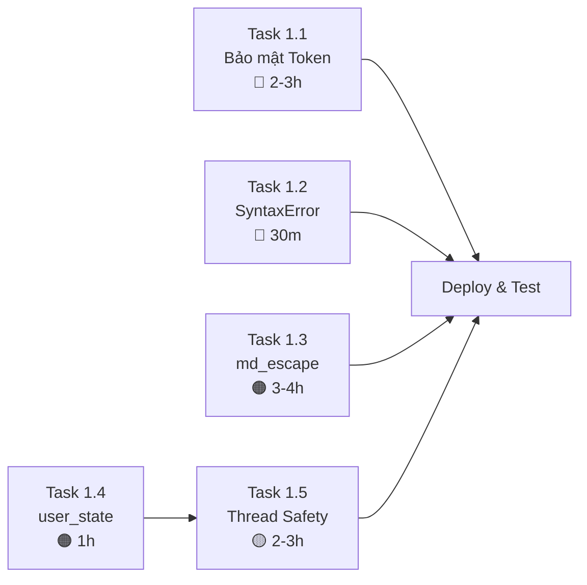

# 🚨 Phase 1: KHẨN CẤP — Bảo Mật & Sửa Bug

> [!CAUTION]
> Phase này phải hoàn thành TRƯỚC KHI triển khai bất kỳ thay đổi nào khác. Các lỗ hổng bảo mật đang **lộ token/API key** ra bên ngoài.

---

## 📋 Metadata

| Thông tin | Chi tiết |
|-----------|----------|
| **Phase** | 1 — Khẩn cấp |
| **Thời gian** | 1–2 ngày |
| **Mục tiêu** | Vá lỗ hổng bảo mật, sửa bug crash, đảm bảo bot chạy ổn định |
| **File chính** | `telegram_bot_v2.py` (1204 dòng) |
| **Môi trường** | Termux / Ubuntu |
| **Ngày tạo** | 2026-06-20 |

---

## 📊 Tổng quan các Task

| Task | Tên | Mức độ | Thời gian | Dependencies |
|------|------|--------|-----------|--------------|
| 1.1 | Bảo mật Token & API Key | 🔴 Nghiêm trọng | 2–3 giờ | Không |
| 1.2 | Sửa SyntaxError f-string | 🔴 Nghiêm trọng | 30 phút | Không |
| 1.3 | Sửa lạm dụng md_escape() | 🟠 Cao | 3–4 giờ | Không |
| 1.4 | Sửa user_state bị ghi đè | 🟠 Cao | 1 giờ | Không |
| 1.5 | Thread Safety | 🟡 Trung bình | 2–3 giờ | Task 1.4 |

---

## Task 1.1: Bảo Mật Token & API Key

> [!CAUTION]
> Token Telegram và API key đang bị **hardcode plaintext** trong source code. Nếu repo bị public hoặc log bị lộ, toàn bộ hệ thống bị chiếm quyền.

### 🔍 Mô tả vấn đề

**Vấn đề 1 — Token hardcode trong source code:**

Dòng 26 `telegram_bot_v2.py`:
```python
TOKEN = "8611261214:AAG9RExIQRBaXlf-j0rjyVPUfQ0lvz6TTWE"
```
Token Telegram Bot nằm trực tiếp trong code. Bất kỳ ai đọc file đều có thể chiếm quyền điều khiển bot.

**Vấn đề 2 — Token bị gửi ra ngoài qua Auto-Debug:**

Dòng 113 `telegram_bot_v2.py`:
```python
prompt = f"Debug this Telegram bot error. Bot is using token {TOKEN} and running on..."
```
Khi bot gặp lỗi, prompt Auto-Debug **gửi nguyên token** cho AGY agent bên ngoài. Đây là **data leak nghiêm trọng** — token bị lộ qua API request ra bên thứ ba.

**Vấn đề 3 — API key plaintext trong config:**

File `ai_providers.json`:
```json
{
  "providers": [
    {
      "name": "openai-compatible",
      "api_key": "sk-7465af9a7d3dc616-pyybjj-04ec0f31",
      "base_url": "https://api.example.com/v1"
    }
  ]
}
```
API key nằm plaintext trong file JSON, có thể bị commit vào git hoặc đọc bởi bất kỳ process nào.

### ✅ Giải pháp

#### Bước 1: Tạo file `.env`

Tạo file `.env` trong thư mục gốc dự án:

```env
# .env — KHÔNG COMMIT FILE NÀY VÀO GIT
TELEGRAM_BOT_TOKEN=8611261214:AAG9RExIQRBaXlf-j0rjyVPUfQ0lvz6TTWE
AI_API_KEY=sk-7465af9a7d3dc616-pyybjj-04ec0f31
AI_BASE_URL=https://api.example.com/v1
```

#### Bước 2: Thêm `.env` vào `.gitignore`

```gitignore
# Secrets
.env
.env.local
.env.production
```

#### Bước 3: Cài đặt python-dotenv

```bash
pip install python-dotenv
```

#### Bước 4: Sửa `telegram_bot_v2.py`

**Trước (dòng 26):**
```python
TOKEN = "8611261214:AAG9RExIQRBaXlf-j0rjyVPUfQ0lvz6TTWE"
```

**Sau:**
```python
import os
from dotenv import load_dotenv

load_dotenv()

TOKEN = os.getenv("TELEGRAM_BOT_TOKEN")
if not TOKEN:
    raise ValueError("❌ TELEGRAM_BOT_TOKEN chưa được cấu hình trong .env")
```

#### Bước 5: Xóa token khỏi Auto-Debug prompt

**Trước (dòng 113):**
```python
prompt = f"Debug this Telegram bot error. Bot is using token {TOKEN} and running on..."
```

**Sau:**
```python
prompt = f"Debug this Telegram bot error. Bot is running on Termux/Ubuntu. Error details: ..."
# KHÔNG BAO GIỜ đưa token, API key, hoặc thông tin nhạy cảm vào prompt gửi ra ngoài
```

#### Bước 6: Sửa `ai_providers.json`

**Trước:**
```json
{
  "providers": [
    {
      "name": "openai-compatible",
      "api_key": "sk-7465af9a7d3dc616-pyybjj-04ec0f31",
      "base_url": "https://api.example.com/v1"
    }
  ]
}
```

**Sau:**
```json
{
  "providers": [
    {
      "name": "openai-compatible",
      "api_key_env": "AI_API_KEY",
      "base_url_env": "AI_BASE_URL"
    }
  ]
}
```

Và trong code đọc config:
```python
import os

def load_provider_config(provider: dict) -> dict:
    """Load provider config, đọc API key từ environment variable."""
    config = dict(provider)
    if "api_key_env" in config:
        config["api_key"] = os.getenv(config.pop("api_key_env"), "")
    if "base_url_env" in config:
        config["base_url"] = os.getenv(config.pop("base_url_env"), "")
    if not config.get("api_key"):
        raise ValueError(f"❌ API key cho provider '{config['name']}' chưa được cấu hình")
    return config
```

#### Bước 7: Revoke token cũ

> [!WARNING]
> Sau khi deploy code mới, **BẮT BUỘC** phải revoke token cũ vì nó đã bị lộ.

```
1. Mở Telegram, chat với @BotFather
2. Gửi /revoke
3. Chọn bot của bạn
4. Nhận token mới
5. Cập nhật token mới vào file .env
6. Restart bot
```

### 📝 Checklist hoàn thành

- [ ] File `.env` đã tạo với đầy đủ secrets
- [ ] `.env` đã thêm vào `.gitignore`
- [ ] `python-dotenv` đã cài đặt
- [ ] Dòng 26: TOKEN đọc từ `os.getenv()` thay vì hardcode
- [ ] Dòng 113: Auto-Debug prompt **không chứa** token/API key
- [ ] `ai_providers.json` không chứa API key plaintext
- [ ] Code đọc AI config đã sửa để đọc key từ env var
- [ ] Token cũ đã revoke qua BotFather
- [ ] Token mới đã cập nhật trong `.env`
- [ ] Bot chạy bình thường với token mới
- [ ] Kiểm tra toàn bộ source code không còn secret nào hardcode (grep -r "sk-" và grep -r "AAG")

### ⏱️ Ước tính thời gian: **2–3 giờ**

---

## Task 1.2: Sửa SyntaxError f-string

> [!CAUTION]
> Bug này khiến bot **crash ngay lập tức** khi user gọi chức năng `selnov_`. Python không thể parse file nếu f-string có lỗi cú pháp.

### 🔍 Mô tả vấn đề

Dòng 474 `telegram_bot_v2.py`:

```python
bot.send_message(chat_id, f"✅ Đã thêm **{md_escape(novel["title"])}** vào danh sách theo dõi!")
```

**Vấn đề:** f-string sử dụng dấu `"` (double quote) để bao bọc chuỗi, nhưng bên trong lại dùng `"` cho `novel["title"]`. Python không thể phân biệt đâu là kết thúc chuỗi, đâu là key của dict.

**Kết quả:** `SyntaxError` — bot crash khi load module hoặc khi function được gọi.

### ✅ Giải pháp

**Trước (dòng 474):**
```python
bot.send_message(chat_id, f"✅ Đã thêm **{md_escape(novel["title"])}** vào danh sách theo dõi!")
```

**Sau — Cách 1 (dùng dấu ngoặc vuông với single quote):**
```python
bot.send_message(chat_id, f"✅ Đã thêm **{md_escape(novel['title'])}** vào danh sách theo dõi!")
```

**Sau — Cách 2 (tách biến ra ngoài, **khuyến nghị**):**
```python
title_escaped = md_escape(novel['title'])
bot.send_message(chat_id, f"✅ Đã thêm **{title_escaped}** vào danh sách theo dõi!")
```

> [!TIP]
> Cách 2 dễ đọc hơn và dễ debug hơn. Nên tách biến khi biểu thức trong f-string phức tạp.

### 📌 Bước thực hiện

1. Mở `telegram_bot_v2.py`, đến dòng 474
2. Sửa f-string theo Cách 2
3. Tìm thêm các f-string tương tự trong toàn file:
   ```bash
   grep -n 'f".*\["' telegram_bot_v2.py
   grep -n "f'.*\['" telegram_bot_v2.py
   ```
4. Sửa tất cả các chỗ tương tự
5. Chạy kiểm tra cú pháp:
   ```bash
   python3 -c "import py_compile; py_compile.compile('telegram_bot_v2.py', doraise=True)"
   ```

### 📝 Checklist hoàn thành

- [ ] Dòng 474 đã sửa — không còn SyntaxError
- [ ] Đã grep toàn file tìm f-string lỗi tương tự
- [ ] `py_compile` pass thành công không có lỗi cú pháp
- [ ] Chức năng `selnov_` hoạt động bình thường khi test

### ⏱️ Ước tính thời gian: **30 phút**

---

## Task 1.3: Sửa Lạm Dụng `md_escape()`

> [!WARNING]
> `md_escape()` đang được dùng **sai ngữ cảnh** ở hàng chục chỗ. Nó chèn ký tự `\` vào callback data, file paths, AI prompts — khiến chức năng bị hỏng âm thầm mà khó debug.

### 🔍 Mô tả vấn đề

Hàm `md_escape()` có nhiệm vụ escape các ký tự đặc biệt của Markdown (như `*`, `_`, `[`, `]`, `(`, `)`) để hiển thị đúng trong tin nhắn Telegram với `parse_mode="MarkdownV2"`.

**Nguyên tắc vàng:**
> `md_escape()` **CHỈ** được dùng cho text hiển thị trong Telegram message với `parse_mode="MarkdownV2"` hoặc `"Markdown"`. **KHÔNG** dùng cho callback data, file paths, AI prompts, hoặc HTML messages.

### 📊 Bảng tổng hợp các chỗ sai

| Nhóm lỗi | Dòng code | Vấn đề | Hậu quả |
|-----------|-----------|--------|---------|
| **callback_data** | 302, 305-306 | `md_escape()` trong callback_data của InlineKeyboard | Telegram callback trả về chuỗi đã escape → không match handler |
| **callback_data** | 459, 555-564 | Escape tên truyện trong callback | So sánh callback_data thất bại |
| **callback_data** | 583-585, 611, 617 | Escape data truyền qua nút bấm | Nút bấm không hoạt động |
| **callback_data** | 651 | Escape trong pagination callback | Chuyển trang lỗi |
| **callback_data** | 876-888 | Escape data cho menu settings | Menu settings hỏng |
| **File paths** | Nhiều chỗ | `md_escape()` khi build đường dẫn file | Thêm `\\` vào tên file → `FileNotFoundError` |
| **AI prompts** | 808, 818 | Escape nội dung gửi cho AI dịch | AI nhận text sai → dịch sai |
| **AI prompts** | 1002 | Escape search query gửi API | Kết quả search bị lệch |
| **HTML message** | 1062 | `md_escape()` cho tin nhắn `parse_mode="HTML"` | Hiển thị ký tự `\` thừa trong tin nhắn |

### ✅ Giải pháp chi tiết

#### 🔸 Nhóm 1: callback_data (KHÔNG escape)

Callback data là **dữ liệu nội bộ**, Telegram không render Markdown cho nó.

**Trước (ví dụ dòng 302):**
```python
InlineKeyboardButton(
    text=novel_title,
    callback_data=f"select_{md_escape(novel_id)}"
)
```

**Sau:**
```python
InlineKeyboardButton(
    text=novel_title,  # text hiển thị → CÓ THỂ escape nếu cần
    callback_data=f"select_{novel_id}"  # callback data → KHÔNG escape
)
```

**Trước (ví dụ dòng 555-564):**
```python
buttons = []
for i, novel in enumerate(results):
    buttons.append(InlineKeyboardButton(
        text=novel['title'],
        callback_data=f"novel_{md_escape(novel['id'])}"
    ))
```

**Sau:**
```python
buttons = []
for i, novel in enumerate(results):
    buttons.append(InlineKeyboardButton(
        text=novel['title'],
        callback_data=f"novel_{novel['id']}"  # Không escape callback data
    ))
```

**Trước (ví dụ dòng 876-888):**
```python
# Settings menu callbacks
InlineKeyboardButton("🔄 Đổi nguồn", callback_data=md_escape("settings_source"))
InlineKeyboardButton("📝 Đổi AI", callback_data=md_escape("settings_ai"))
InlineKeyboardButton("⚙️ Pipeline", callback_data=md_escape("settings_pipeline"))
```

**Sau:**
```python
InlineKeyboardButton("🔄 Đổi nguồn", callback_data="settings_source")
InlineKeyboardButton("📝 Đổi AI", callback_data="settings_ai")
InlineKeyboardButton("⚙️ Pipeline", callback_data="settings_pipeline")
```

> [!IMPORTANT]
> Khi sửa callback_data, cần kiểm tra **cả handler nhận callback** (`callback_query_handler`). Nếu handler đang so sánh với giá trị đã escape, phải sửa handler luôn.

#### 🔸 Nhóm 2: File paths (KHÔNG escape)

**Trước:**
```python
file_path = f"Data/{md_escape(novel_name)}/chapter_{chapter_num}.txt"
```

**Sau:**
```python
file_path = f"Data/{novel_name}/chapter_{chapter_num}.txt"
# File path KHÔNG BAO GIỜ escape — hệ thống file không hiểu ký tự markdown
```

#### 🔸 Nhóm 3: AI prompts (KHÔNG escape)

**Trước (dòng 808):**
```python
prompt = f"Dịch đoạn văn sau từ Trung sang Việt:\n{md_escape(chinese_text)}"
```

**Sau:**
```python
prompt = f"Dịch đoạn văn sau từ Trung sang Việt:\n{chinese_text}"
# AI cần nhận text GỐC, không escape
```

**Trước (dòng 1002):**
```python
search_query = md_escape(user_input)
results = search_api(search_query)
```

**Sau:**
```python
search_query = user_input  # Không escape search query
results = search_api(search_query)
```

#### 🔸 Nhóm 4: HTML parse_mode (dùng html.escape thay vì md_escape)

**Trước (dòng 1062):**
```python
bot.send_message(
    chat_id,
    f"<b>Kết quả:</b> {md_escape(result_text)}",
    parse_mode="HTML"
)
```

**Sau:**
```python
import html

bot.send_message(
    chat_id,
    f"<b>Kết quả:</b> {html.escape(result_text)}",
    parse_mode="HTML"
)
```

### 📌 Bước thực hiện

1. **Liệt kê tất cả lời gọi `md_escape`:**
   ```bash
   grep -n "md_escape" telegram_bot_v2.py | nl
   ```

2. **Phân loại từng lời gọi** vào một trong 4 nhóm:
   - ✅ **Giữ nguyên:** Text hiển thị trong Telegram message với `parse_mode="MarkdownV2"` hoặc `"Markdown"`
   - ❌ **Xóa escape:** callback_data, file paths, AI prompts, search queries
   - 🔄 **Đổi sang html.escape:** Message dùng `parse_mode="HTML"`

3. **Sửa từng nhóm** theo thứ tự: callback_data → file paths → AI prompts → HTML

4. **Kiểm tra callback handlers:** Đảm bảo handler nhận đúng giá trị sau khi bỏ escape

5. **Test từng chức năng:**
   - Bấm các nút inline keyboard
   - Tìm kiếm truyện có ký tự đặc biệt
   - Dịch nhanh một đoạn văn
   - Xem truyện → kiểm tra file path

### 📝 Checklist hoàn thành

- [ ] Đã liệt kê tất cả lời gọi `md_escape()` trong file
- [ ] **callback_data:** Xóa md_escape ở dòng 302, 305-306, 459, 555-564, 583-585, 611, 617, 651, 876-888
- [ ] **File paths:** Xóa md_escape ở tất cả chỗ build đường dẫn file
- [ ] **AI prompts:** Xóa md_escape ở dòng 808, 818, 1002
- [ ] **HTML message:** Đổi sang `html.escape()` ở dòng 1062
- [ ] Callback handlers đã kiểm tra và sửa cho đồng bộ
- [ ] Tất cả nút inline keyboard hoạt động đúng
- [ ] Tìm kiếm truyện hoạt động với ký tự đặc biệt
- [ ] Dịch nhanh nhận text gốc không bị escape
- [ ] File path không chứa ký tự `\` thừa

### ⏱️ Ước tính thời gian: **3–4 giờ**

### 🔗 Dependencies: Không

---

## Task 1.4: Sửa `user_state` Bị Ghi Đè

> [!WARNING]
> Mỗi khi user search, **toàn bộ state** (truyện đang đọc, cài đặt, tiến trình) bị reset về `{}` nếu user chưa có state.

### 🔍 Mô tả vấn đề

Dòng 830 `telegram_bot_v2.py`:

```python
user_state[chat_id] = user_state.get(chat_id, {})
```

**Logic lỗi:**
- Nếu `chat_id` **chưa có** trong `user_state` → tạo dict rỗng `{}` → OK ✅
- Nếu `chat_id` **đã có** trong `user_state` → `user_state.get()` trả về state hiện tại → gán lại chính nó → vô hại nhưng thừa
- **VẤN ĐỀ THỰC SỰ:** Dòng code này nằm ở **đầu hàm search**. Nếu ngay sau đó có code gán thêm trường mới mà KHÔNG kiểm tra trường cũ, state cũ sẽ bị mất.

**Ví dụ kịch bản lỗi:**
```python
# Dòng 830
user_state[chat_id] = user_state.get(chat_id, {})
# Dòng 831-835
user_state[chat_id] = {
    "action": "searching",
    "query": query
}  # ← GHI ĐÈ TOÀN BỘ state cũ! Mất reading_novel, settings, v.v.
```

### ✅ Giải pháp

**Trước:**
```python
user_state[chat_id] = user_state.get(chat_id, {})
user_state[chat_id] = {
    "action": "searching",
    "query": query
}
```

**Sau:**
```python
if chat_id not in user_state:
    user_state[chat_id] = {}

# Chỉ cập nhật trường cần thiết, KHÔNG ghi đè toàn bộ dict
user_state[chat_id]["action"] = "searching"
user_state[chat_id]["query"] = query
```

**Hoặc dùng `setdefault` (pythonic hơn):**
```python
state = user_state.setdefault(chat_id, {})
state["action"] = "searching"
state["query"] = query
```

> [!TIP]
> `dict.setdefault(key, default)` trả về giá trị hiện tại nếu key tồn tại, hoặc gán default và trả về nó. An toàn hơn pattern `dict[key] = dict.get(key, {})`.

### 📌 Bước thực hiện

1. Tìm tất cả chỗ gán `user_state[chat_id] = ...` trong file:
   ```bash
   grep -n "user_state\[chat_id\] =" telegram_bot_v2.py
   ```

2. Kiểm tra từng chỗ xem có ghi đè toàn bộ dict không

3. Sửa thành `setdefault()` + gán từng trường

4. Tìm thêm pattern tương tự:
   ```bash
   grep -n "user_state\[.*\] = {" telegram_bot_v2.py
   ```

5. Test: Search truyện → kiểm tra state cũ (đang đọc truyện, cài đặt) có bị mất không

### 📝 Checklist hoàn thành

- [ ] Dòng 830 đã sửa thành `setdefault()` pattern
- [ ] Đã grep tất cả chỗ gán `user_state[chat_id] = {...}` 
- [ ] Tất cả đã sửa thành gán từng trường riêng lẻ
- [ ] Test: Search không làm mất state đang đọc truyện
- [ ] Test: Search không làm mất cài đặt user

### ⏱️ Ước tính thời gian: **1 giờ**

### 🔗 Dependencies: Không (nhưng nên làm trước Task 1.5)

---

## Task 1.5: Thread Safety cho Shared State

> [!WARNING]
> `user_state` và `pinned_messages` là dict thường, bị nhiều thread đọc/ghi đồng thời. Có thể gây **race condition**, **data corruption**, hoặc **crash** khi bot có nhiều user.

### 🔍 Mô tả vấn đề

Trong `telegram_bot_v2.py`:

```python
# Global state — KHÔNG thread-safe
user_state = {}        # Nhiều callback handler ghi đồng thời
pinned_messages = {}   # Daemon thread + callback thread đọc/ghi
```

**Các thread truy cập đồng thời:**
1. **Main thread:** Xử lý Telegram webhook/polling
2. **Callback handlers:** Mỗi tin nhắn/callback chạy trên thread riêng (telebot)
3. **Daemon threads:** `raw_processor`, `project_init`, `pipeline_exec` — chạy nền

**Kịch bản race condition:**

```
Thread A (user 123 search):      Thread B (user 123 read chapter):
─────────────────────────────     ──────────────────────────────────
state = user_state[123]           state = user_state[123]
state["action"] = "searching"    
                                  state["action"] = "reading"
                                  state["chapter"] = 5
state["query"] = "斗破苍穹"       
# → state bây giờ:
# {"action": "searching", "query": "斗破苍穹", "chapter": 5}
# → Trạng thái hỗn loạn!
```

### ✅ Giải pháp

#### Cách 1: Dùng `threading.Lock` (Đơn giản, áp dụng ngay Phase 1)

```python
import threading

# Tạo lock cho mỗi shared resource
state_lock = threading.Lock()
pinned_lock = threading.Lock()

user_state = {}
pinned_messages = {}
```

**Sử dụng lock khi đọc/ghi:**

```python
# Trước — không an toàn
user_state[chat_id]["action"] = "searching"

# Sau — thread-safe
with state_lock:
    state = user_state.setdefault(chat_id, {})
    state["action"] = "searching"
    state["query"] = query
```

```python
# Trước — không an toàn
pinned = pinned_messages.get(chat_id, [])
pinned.append(message_id)
pinned_messages[chat_id] = pinned

# Sau — thread-safe
with pinned_lock:
    pinned = pinned_messages.setdefault(chat_id, [])
    pinned.append(message_id)
```

#### Cách 2: Helper functions (Tốt hơn, đóng gói logic lock)

```python
import threading

_state_lock = threading.Lock()
_user_state = {}

def get_user_state(chat_id: int, key: str, default=None):
    """Thread-safe đọc user state."""
    with _state_lock:
        return _user_state.get(chat_id, {}).get(key, default)

def set_user_state(chat_id: int, **kwargs):
    """Thread-safe ghi user state."""
    with _state_lock:
        state = _user_state.setdefault(chat_id, {})
        state.update(kwargs)

def clear_user_action(chat_id: int):
    """Thread-safe xóa action hiện tại."""
    with _state_lock:
        if chat_id in _user_state:
            _user_state[chat_id].pop("action", None)
```

**Sử dụng:**
```python
# Trước
user_state[chat_id] = {"action": "searching", "query": query}

# Sau
set_user_state(chat_id, action="searching", query=query)

# Trước
action = user_state.get(chat_id, {}).get("action")

# Sau
action = get_user_state(chat_id, "action")
```

#### Áp dụng cho `pinned_messages`:

```python
_pinned_lock = threading.Lock()
_pinned_messages = {}

def add_pinned_message(chat_id: int, message_id: int):
    with _pinned_lock:
        msgs = _pinned_messages.setdefault(chat_id, [])
        if message_id not in msgs:
            msgs.append(message_id)

def get_pinned_messages(chat_id: int) -> list:
    with _pinned_lock:
        return list(_pinned_messages.get(chat_id, []))
```

### 📌 Bước thực hiện

1. **Liệt kê tất cả truy cập shared state:**
   ```bash
   grep -n "user_state\[" telegram_bot_v2.py | wc -l
   grep -n "pinned_messages" telegram_bot_v2.py | wc -l
   ```

2. **Tạo helper functions** (Cách 2) ở đầu file hoặc trong module `state.py` riêng

3. **Thay thế tất cả truy cập trực tiếp** bằng helper functions:
   - `user_state[chat_id] = ...` → `set_user_state(chat_id, ...)`
   - `user_state.get(chat_id, {})` → `get_user_state(chat_id, key)`
   - `pinned_messages[chat_id]` → `get_pinned_messages(chat_id)` / `add_pinned_message(...)`

4. **Test concurrent access:**
   ```python
   # Test script đơn giản
   import threading
   
   def simulate_user(chat_id):
       for i in range(100):
           set_user_state(chat_id, action=f"test_{i}", counter=i)
           state = get_user_state(chat_id, "counter")
   
   threads = [threading.Thread(target=simulate_user, args=(1,)) for _ in range(10)]
   for t in threads:
       t.start()
   for t in threads:
       t.join()
   print("✅ Thread safety test passed")
   ```

5. **Test bot với 2+ users** gửi lệnh đồng thời

### 📝 Checklist hoàn thành

- [ ] Helper functions cho `user_state` đã tạo (get/set/clear)
- [ ] Helper functions cho `pinned_messages` đã tạo (add/get)
- [ ] Tất cả truy cập trực tiếp `user_state[...]` đã thay bằng helper
- [ ] Tất cả truy cập trực tiếp `pinned_messages[...]` đã thay bằng helper
- [ ] Thread safety test script pass
- [ ] Bot hoạt động bình thường khi 2 users gửi lệnh đồng thời
- [ ] Không có `RuntimeError: dictionary changed size during iteration`

### ⏱️ Ước tính thời gian: **2–3 giờ**

### 🔗 Dependencies: Task 1.4 (nên hoàn thành trước để tránh conflict)

---

## 📊 Tổng Kết Phase 1

### Thứ tự thực hiện khuyến nghị



**Thứ tự ưu tiên:**
1. 🔴 **Task 1.1** — Bảo mật token (LÀM NGAY)
2. 🔴 **Task 1.2** — SyntaxError (nhanh, critical)
3. 🟠 **Task 1.3** — md_escape (nhiều chỗ, ảnh hưởng rộng)
4. 🟠 **Task 1.4** → 🟡 **Task 1.5** — State management (làm tuần tự)

### Tổng Checklist Phase 1

| # | Task | Status |
|---|------|--------|
| 1.1 | Token/API key không còn hardcode | ⬜ |
| 1.1 | Auto-Debug không gửi token ra ngoài | ⬜ |
| 1.1 | Token cũ đã revoke | ⬜ |
| 1.2 | SyntaxError f-string đã fix | ⬜ |
| 1.2 | `py_compile` pass | ⬜ |
| 1.3 | callback_data không còn md_escape | ⬜ |
| 1.3 | File paths không còn md_escape | ⬜ |
| 1.3 | AI prompts không còn md_escape | ⬜ |
| 1.3 | HTML messages dùng html.escape | ⬜ |
| 1.4 | user_state dùng setdefault pattern | ⬜ |
| 1.5 | Shared state có thread lock | ⬜ |
| ALL | Bot chạy ổn định 30 phút không crash | ⬜ |
| ALL | Tất cả chức năng chính hoạt động | ⬜ |

### Tổng thời gian ước tính: **9–11.5 giờ** (1–2 ngày làm việc)

---

> [!IMPORTANT]
> Sau khi hoàn thành Phase 1, **backup toàn bộ code** trước khi bắt đầu Phase 2. Phase 2 sẽ refactor kiến trúc lớn — cần có bản backup ổn định để rollback nếu cần.
